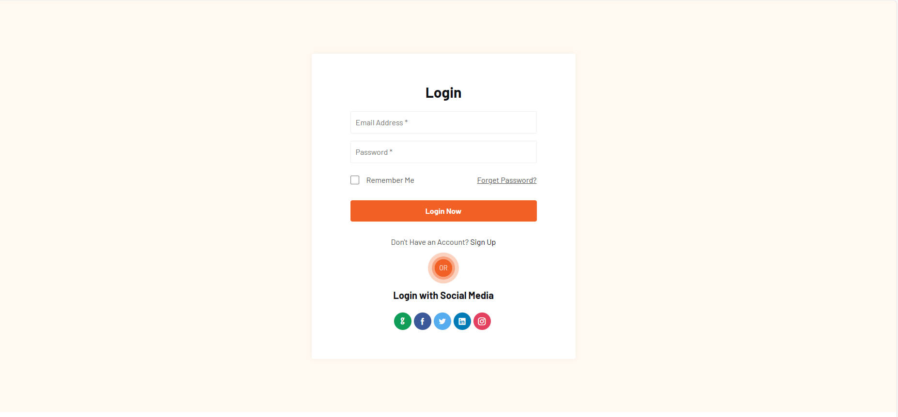
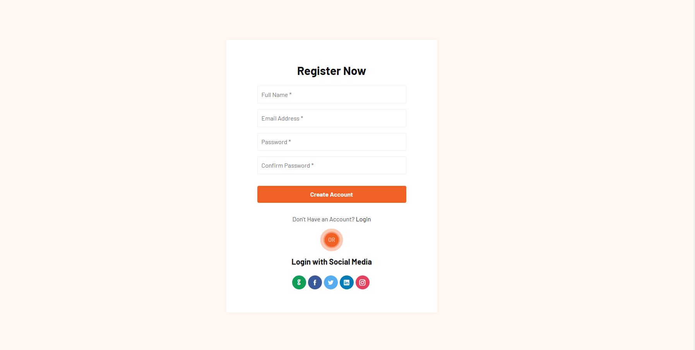
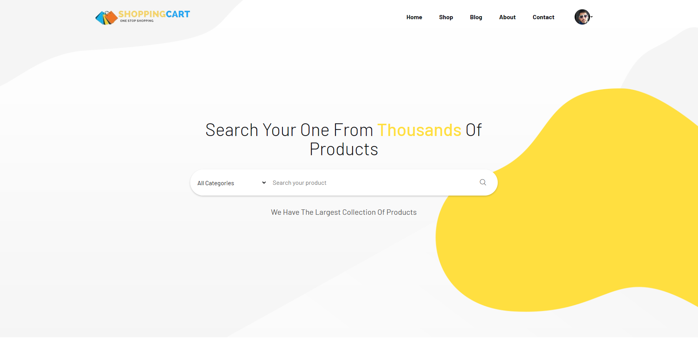
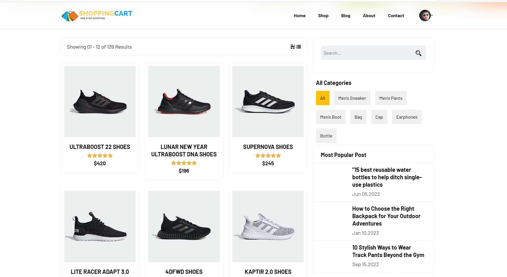
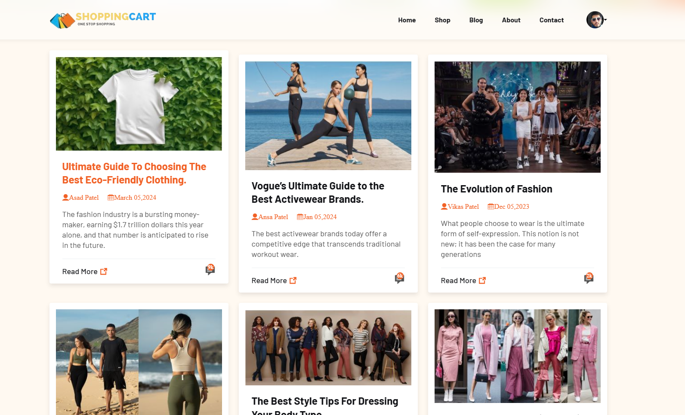
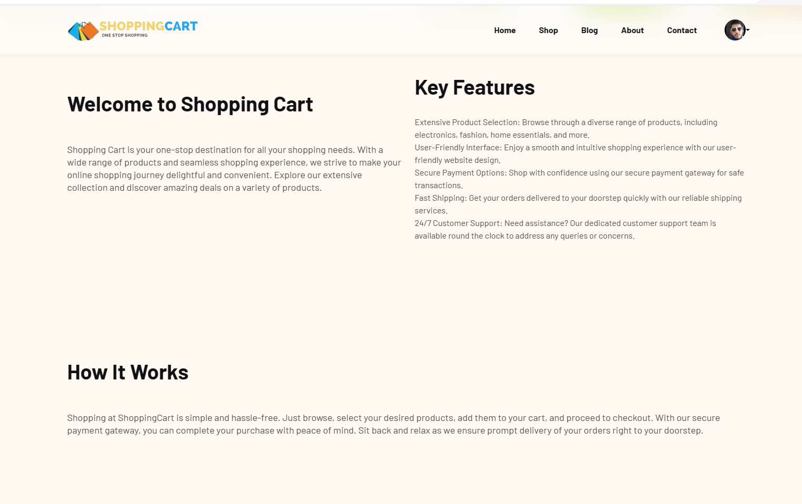
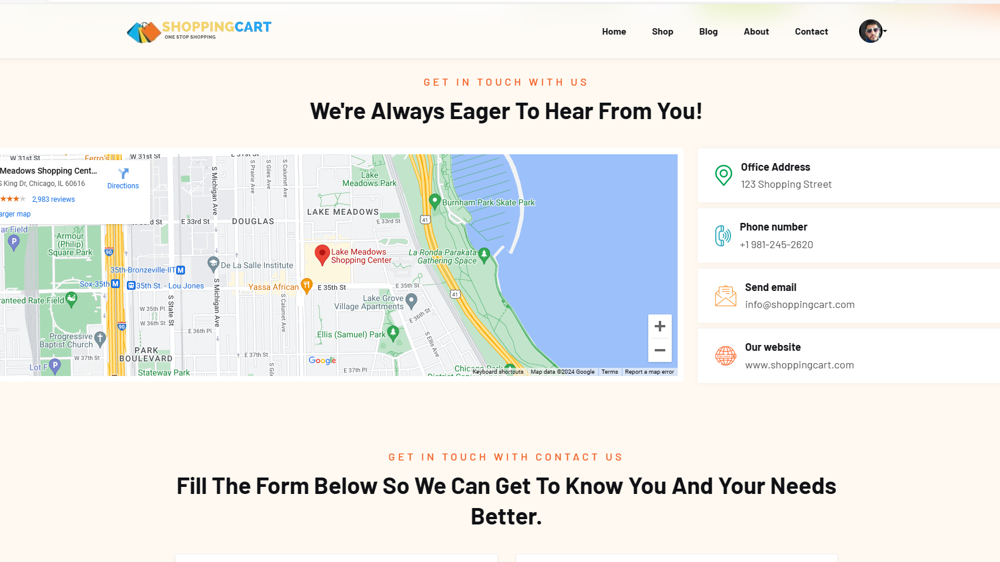
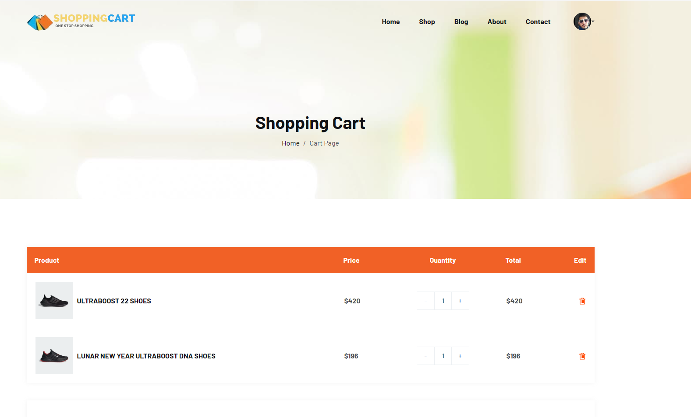
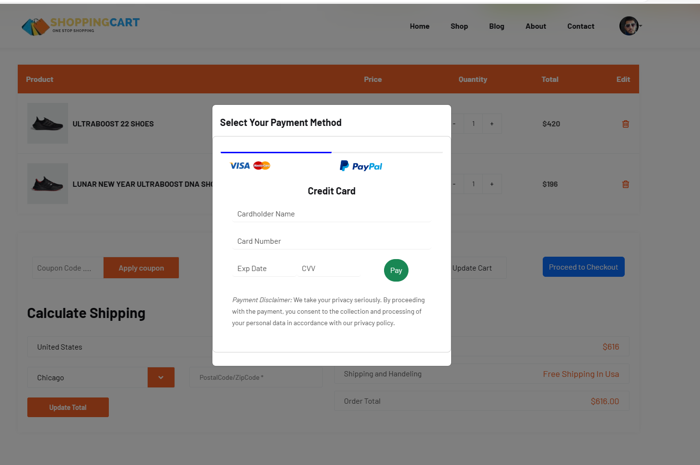

# OneStopShoppingWebsite - ShoppingCart

Welcome to ShoppingCart, your one-stop destination for all your shopping needs. This web application provides a convenient platform for users to explore and purchase products across various categories. With a user-friendly interface and essential features, OneStopShoppingWebsite aims to deliver a seamless shopping experience to its users.
| Preview 1 | Preview 2 | Preview 3 |
|-----------|-----------|-----------|
||||
||||
||||

## Features

- **Product Categories**: Explore a wide range of products conveniently categorized for easy navigation.
- **Search Functionality**: Quickly find specific products using the search feature.
- **User Authentication**: Create an account, log in, and manage your profile securely.
- **Shopping Cart**: Add products to your cart and proceed to checkout effortlessly.
- **Order Tracking**: Keep track of the status of your orders conveniently.
## 🚀 About Me


## About Me

Hi there! 👋 I'm Asad Patel, a self-learning front-end developer aspiring to create captivating and user-centric web experiences. As someone new to the world of coding, I'm deeply passionate about learning and mastering the art of front-end development.

### My Journey

I am Transitioning My Journey from healthcare to tech has been an exciting and challenging journey. I've always been fascinated by the potential of technology to transform industries and improve lives. Inspired by this vision, I decided to pivot into front-end development to leverage my analytical skills and creativity in building innovative solutions for users.


### Learning Path

Currently, I'm on a self-learning journey, exploring HTML, CSS, and JavaScript through online courses, tutorials, and hands-on projects. I'm dedicated to mastering the fundamentals of front-end development and continuously enhancing my skills to create visually appealing and functional websites.

### My Goals

My primary goal as a self-learning front-end developer is to build a strong foundation in front-end technologies and acquire proficiency in creating responsive and accessible web interfaces. Ultimately, I aim to transition into a career as a professional front-end developer, where I can contribute to innovative projects and collaborate with like-minded individuals in the tech community.

### Let's Connect!

I'm always eager to connect with fellow developers, mentors, and enthusiasts in the front-end community. Whether it's discussing coding challenges, sharing resources, or collaborating on projects, I'd love to hear from you! Feel free to reach out to me via [email](mailto:asadpatel517@gmail.com) or connect with me on [LinkedIn](https://www.linkedin.com/in/asad--patel).

---


## Installation

To run OneStop Shopping Website - PatelCart locally, follow these steps:

1. Clone the repository:
   ```bash
   git clone https://github.com/yourusername/OneStopShoppingWebsite.git
   ```
2. Navigate to the project directory:
   ```bash
   cd OneStopShoppingWebsite
   ```
3. Install dependencies:
   ```bash
   npm install
   ```
4. Start the development server:
   ```bash
   npm start
   ```
5. Open your web browser and navigate to http://localhost:3000 to access the website.

## 🛠 Skills
- javaScript
- HTML
- CSS
- React.js
- Bootstrap 
- Version Control 
- Responsive Web Design


## Contributing

Contributions are always welcome!

See `contributing.md` for ways to get started.

Please adhere to this project's `code of conduct`.

